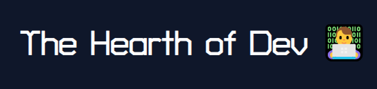
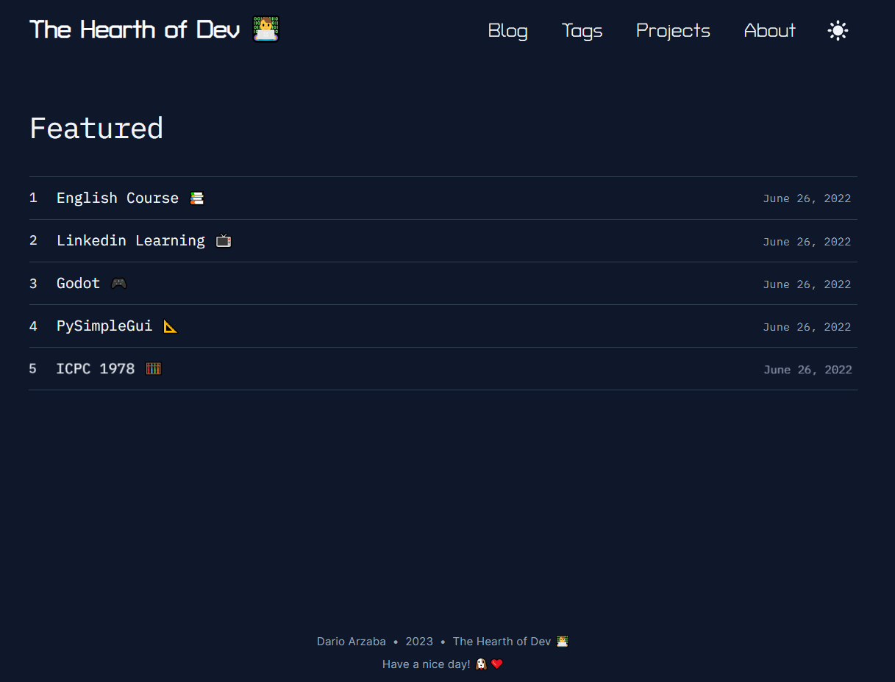
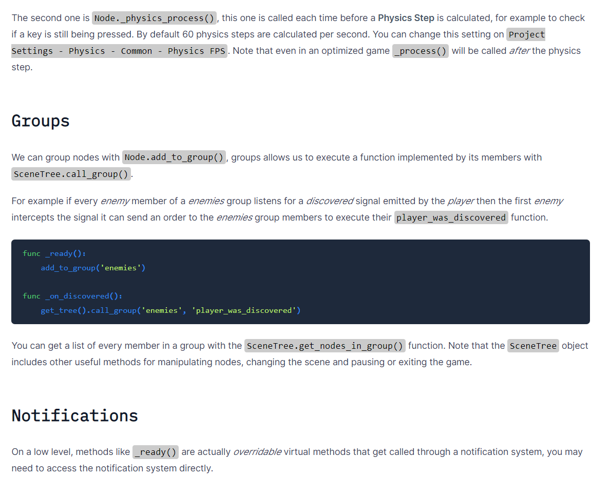

<br />
<div align="center">
  <a href="https://github.com/othneildrew/Best-README-Template">
    
  </a>

  <h3 align="center">My Personal Blog</h3>

  <p align="center">
    <a href="https://darioarzaba.vercel.app/"><strong>Explore the site »</strong></a>

  </p>
</div>
<div align="center">
  <a href="https://nextjs.org/">
    
    <a href="https://tailwindcss.com/">
    
  </a>
</div>

## About

You can read more about the technology behind this blog in my dedicated post:

* [Creating a Blog with MDX](https://darioarzaba.vercel.app/blog/programming/markdown)

## Installation

1. Clone the repo
   ```sh
   git clone https://github.com/DarioArzaba/blog
   cd blog
   ```
2. Install and rebuild NPM packages
   ```sh
   npm install
   npm rebuild
   ```
4. Deploy either in `build` mode or `dev`
   ```js
   npm run build
   ```

## Usage

Special thanks to [timlrx](https://github.com/timlrx) for his amazing [starter template](https://tailwind-nextjs-starter-blog.vercel.app/). 

</br>

<div align="center">
<p> Dark Mode featured starting page </p>
</div>



</br>

<div align="center">
<p> Light Mode code examples </p>
</div>



## License

Distributed under the [MIT License](https://mit-license.org/).

## Contact

Dario Arzaba - dario.arzaba@gmail.com